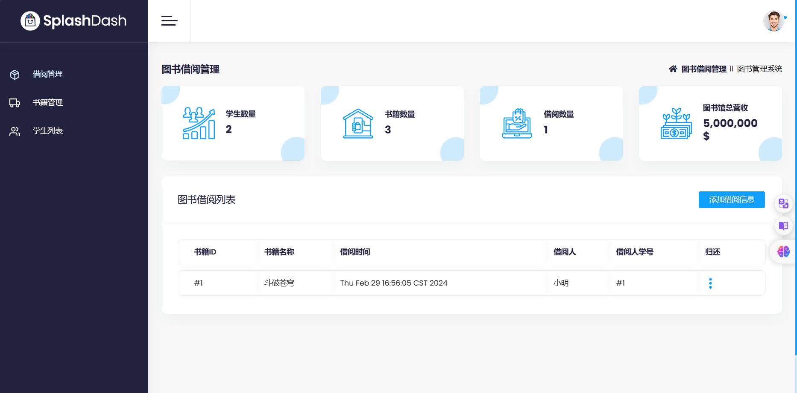
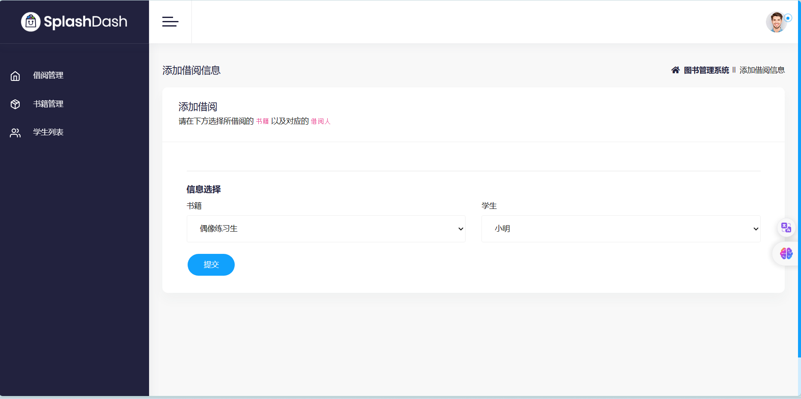
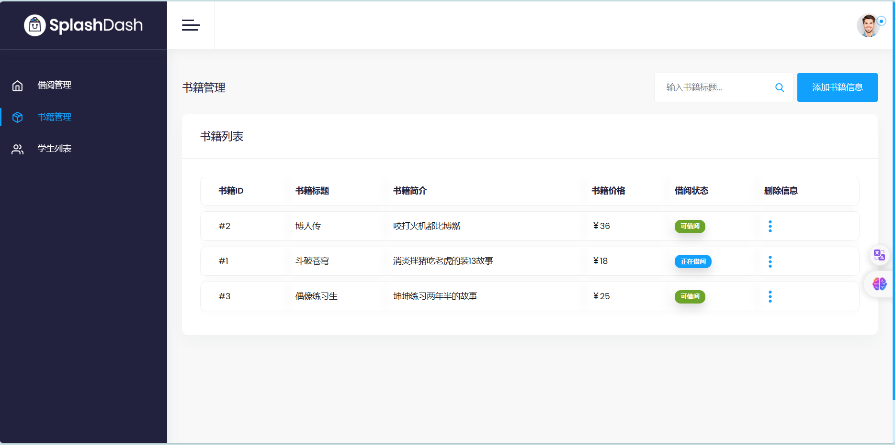
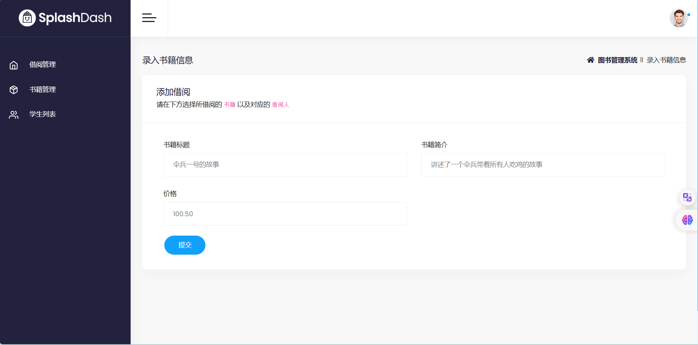
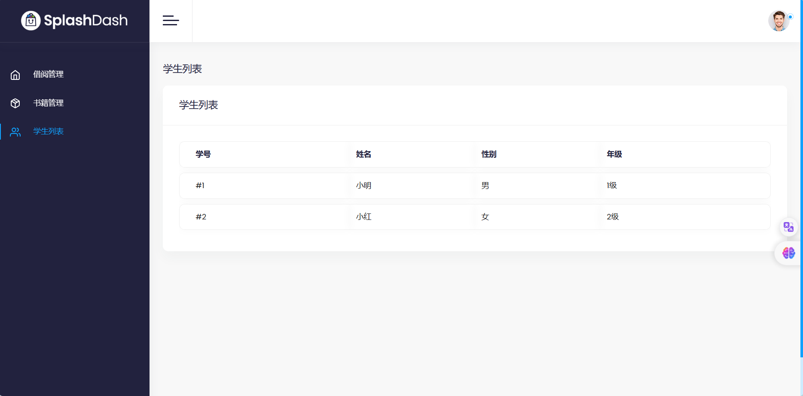
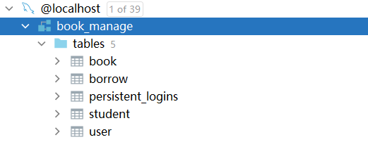

# 图书管理系统

#### 介绍

基于Spring+SpringMVC+SpringSecurity+Mybatis+Mysql+Thymeleaf的图书管理系统

#### 软件架构

1.登录界面

2.首页（图书借阅信息）

2.1添加借阅信息

3.书籍管理

3.1添加书籍信息

4.学生列表

5.退出登录

6.数据库

#### 安装教程

1. 开发环境：Windows 11
2. 开发工具：IDEA 2021 (Ultimate)
3. JDK版本：17.0.10
4. 构建工具：Maven 3.6.3
5. 数据库版本：MySQL 8.0
6. 数据库连接工具：Navicat For MySQL 10.1.7
7. 服务器：Tomcat 10.1.19
8. 调试工具：Microsoft Edge

#### 使用说明

1. 运行数据库脚本导入项目所使用的数据库
2. 使用IDEA导入项目
3. 连接数据库，将数据源配置修改为自己的用户名与密码
4. 部署Tomcat服务器
5. 启动项目

#### 参与贡献

@subpyte ：2219084706@qq.com

#### 特技

1.  使用 Readme\_XXX.md 来支持不同的语言，例如 Readme\_en.md, Readme\_zh.md
2.  Gitee 官方博客 [blog.gitee.com](https://blog.gitee.com)
3.  你可以 [https://gitee.com/explore](https://gitee.com/explore) 这个地址来了解 Gitee 上的优秀开源项目
4.  [GVP](https://gitee.com/gvp) 全称是 Gitee 最有价值开源项目，是综合评定出的优秀开源项目
5.  Gitee 官方提供的使用手册 [https://gitee.com/help](https://gitee.com/help)
6.  Gitee 封面人物是一档用来展示 Gitee 会员风采的栏目 [https://gitee.com/gitee-stars/](https://gitee.com/gitee-stars/)
